# Plantuml as tool for modeling in UML

## UML
∏
UML means Unified Modeling Language and is a specification of a modeling language. 

The specification can be found here 
- [About the Unified Modeling Language Specification Version 2.5.1](https://www.omg.org/spec/UML/About-UML/)

For modeling UML there are a lot of tools available from simple online drawing tools up to enterprise tools for software architects with code generation and a lot more integrated functionalities.

##  PlantUML

However, more and more companies and open source projects make use of lightweight software. For educational purposes it also makes sense to keep things simple to support the learning process and not to be an expert in a special software tool or just learn usage of a specific tool.

Therefore [PlantUML](https://plantuml.com/) is the tool of choice as it allows to create models based on simple text, thus allows to use version control as with code on all models.

## Set up

To set up the environment it is recommended to use a simple editor. The preferred editor of choice and where we support is [Visual Studio Code ](https://code.visualstudio.com/) with the PlantUML Plugin (extension).

So do the following steps:

- Download and install [Visual Studio Code ](https://code.visualstudio.com/)
- Start Visual Studio Code
- install the PlantUML plugin

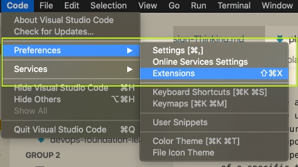


- Create a new file, call it test.puml
- fill in the following example code:

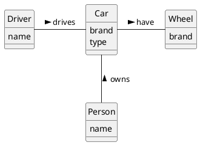

- now press **Alt-d** to generate PlantUML Preview. 
- Additional functionalities like generate an SVG or PNG file can be found via the command palette (Menu > View > Command Palette)

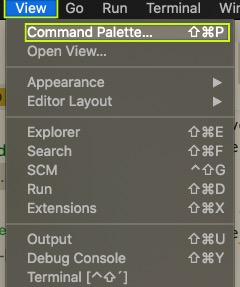

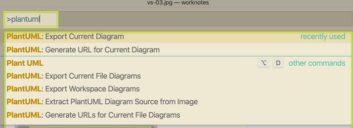


## UML models in PlantUML

See [Language specification pages](https://plantuml.com/sitemap-language-specification) and then choose diagram type for example and explanations of the syntax.

### Examples

#### Use Case diagram

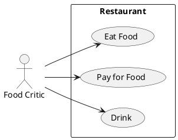

#### Activity Diagram

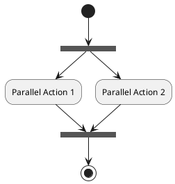

#### Class diagram

```plantuml
skinparam classAttributeIconSize 0
skinparam monochrome true
skinparam componentStyle uml2
hide circle

class ATM {
    -addTransaction(atm:ATMTransaction)
    +withdraw(card:BankCard, amount:int)
    -findBank(card:BankCard):Bank
    -makeMoneyAvailable()
}

class Customer {
    -name:String
}

class BankCard {
    -cardNumber:int
}

class Account {
    -accountNumber:int
    -withDraw(amount:int)
}

class ATMTransaction {
    ATMTransaction(atm:ATM, card:BankCard,amount:int)
}

class Bank {
    -findAccount(card:BankCard):Account
    +withDraw(atm:ATM, card:BankCard,amount:int):ATMTransaction
}

ATM "1" -down-> "*" ATMTransaction
ATMTransaction "*" -right-> "1" BankCard
Account "*" -up-> "1" Customer
Account "1" -left-> "*" BankCard
Bank "1" -up-> "*" Account
Bank -.up.-> ATMTransaction : <<creates>>

```

#### Sequence diagram 

```plantuml
skinparam classAttributeIconSize 0
skinparam monochrome true
skinparam componentStyle uml2
hide circle
hide footbox

actor User

User-> A: DoWork

activate A

A -> A: Internal call
activate A

create B
A --> B : << create >>

A -> B : doSomething()
activate B
A<--B : returnSomething
deactivate B
deactivate A
User<- A: Done
deactivate A
```

#### State Machine Diagram

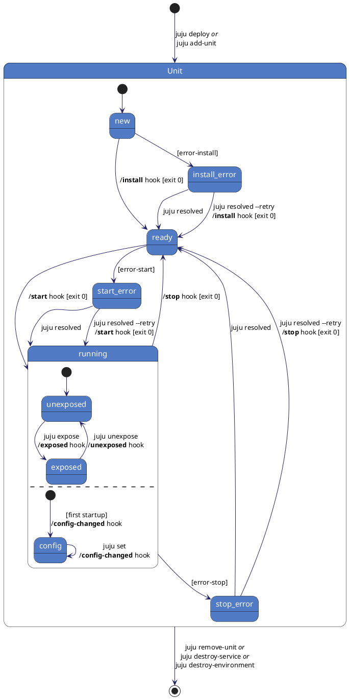
#### Component diagram

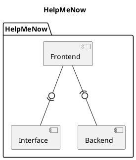

#### Deployment diagram

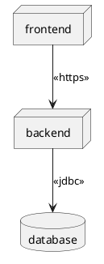

#### UI-Design

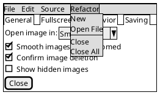

#### WBS

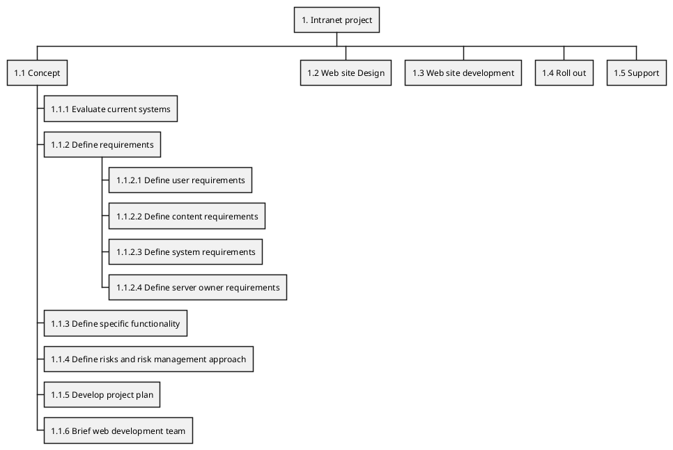


#### GANTT-Chart

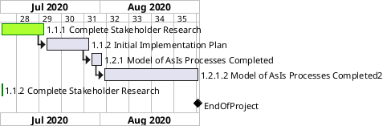

#### Use Graphviz Dot language

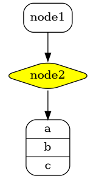

For more examples, see [Language specification pages](https://plantuml.com/sitemap-language-specification).


## Embed plantuml code in your markdown file

If you look into the source code of this file, you see that planuml code is embedded into markdown. In visual studio code preview, the plantuml picture will be automatically generated.

It looks like:

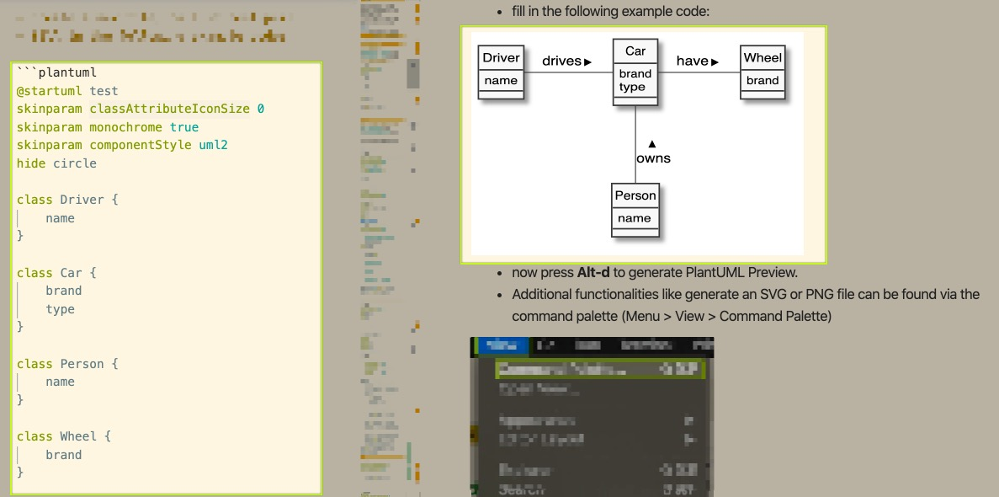

Embed in your markdown the planuml code as follows:

