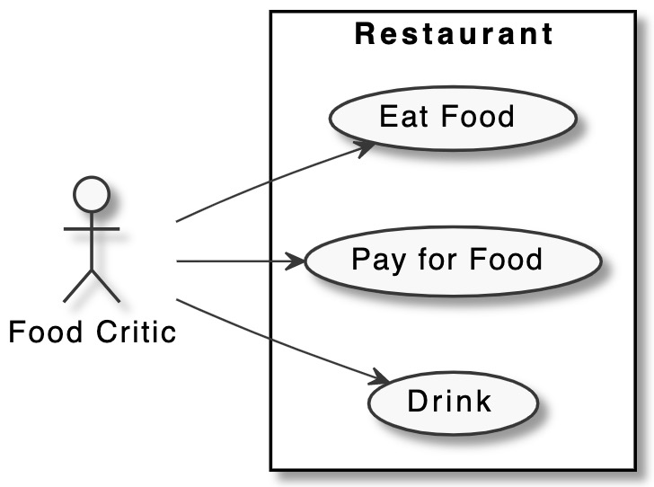
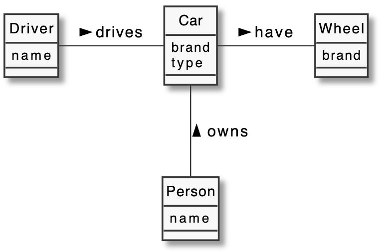

# Analysis

Put in here all analysis artefacts and documentation.

> Below are only examples! You can also use Visual Paradigm Models. Remove this and this text. 

## Use Case Diagram

## Domain Model

