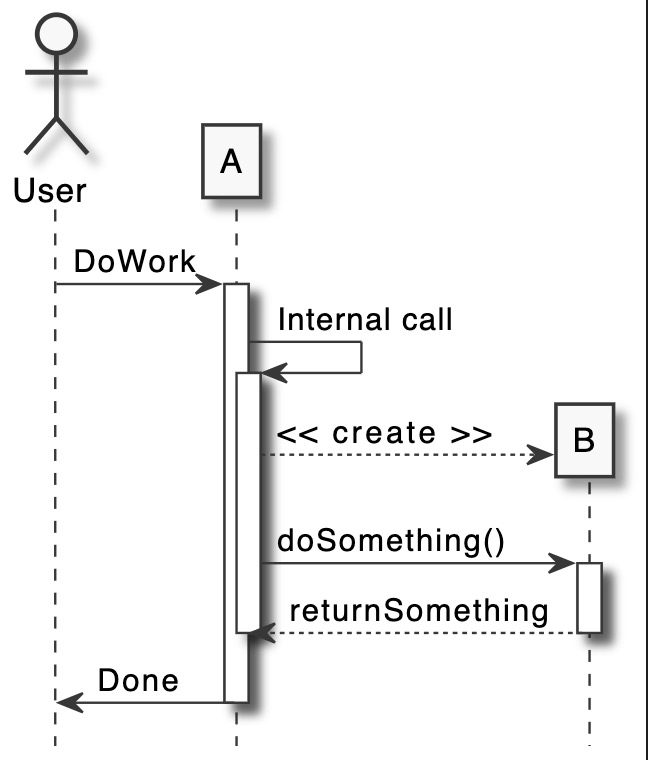

# Design

Put in here all design artefacts and documentation.

> Below are only examples! You can also use Visual Paradigm Models. Remove this and this text. 

## Class diagrams

## Sequence diagrams

## UI-Design / Wireframes / Mockups

