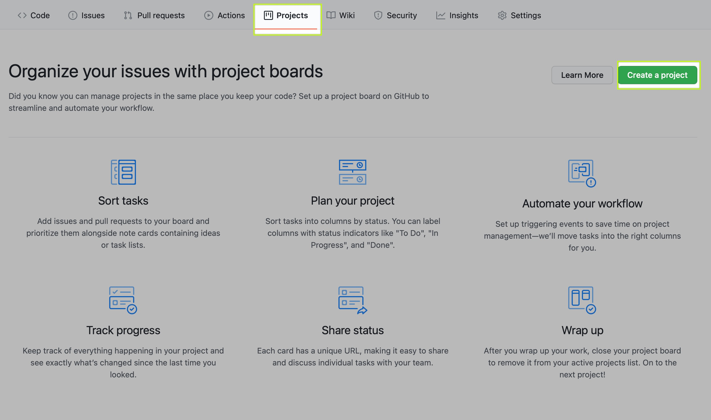
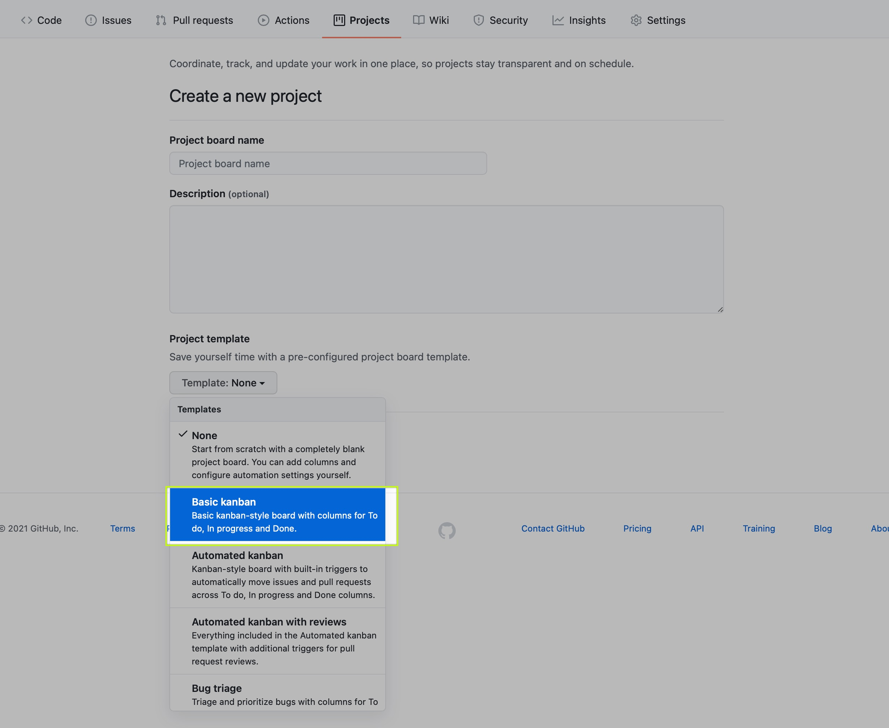
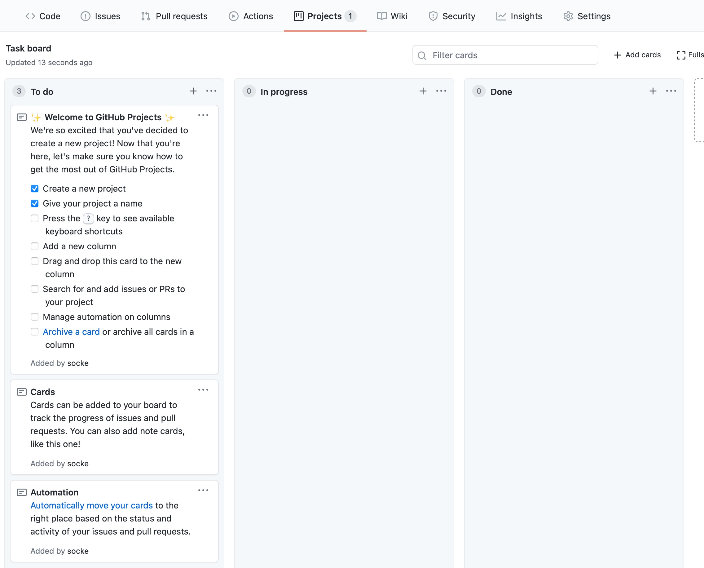
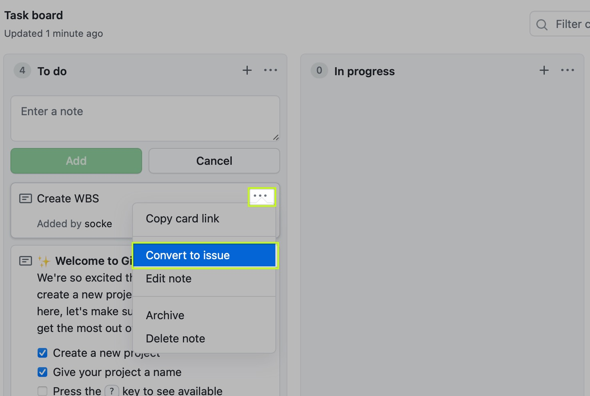

# Project Management

Put in here all PM Material.

We strongly recommend to use the build in github project board.

Create a Basic kanban board:

This is your task board then:

Important that you "convert" your notes to issues as these have more options:

